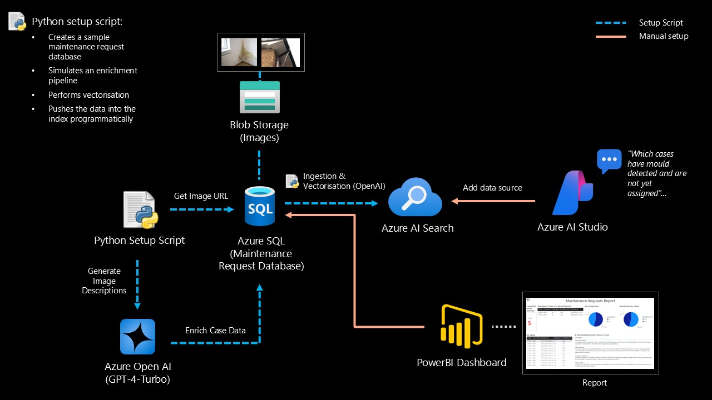
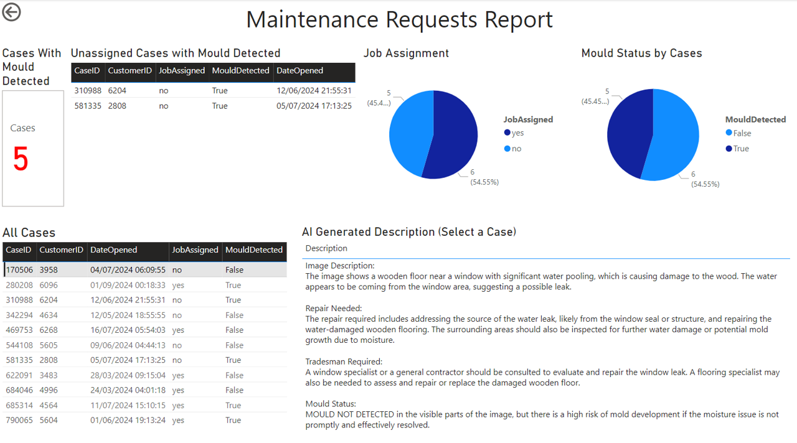
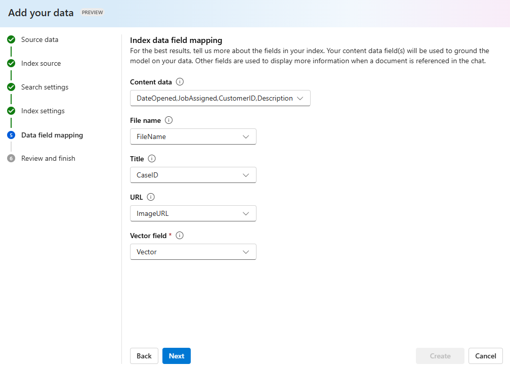
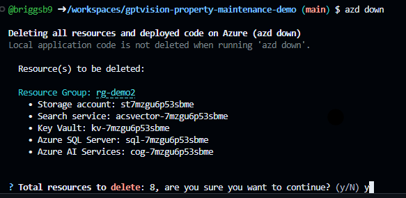

# AI Enriched Search Index for Property Maintenance Photos

This project showcases how Generative AI can enhance the processing of property maintenance photos to identify priority issues like mould and damp.

It achieves this by:
- Creating a sample SQL Database to simulate an existing maintenance request system
- Using GPT-4 to generate text descriptions for case photos, offering a summary of the issue, the required tradesperson, and flagging cases where mould is present
- Writing the GenAI insights back to the sample maintenance request system (SQL DB) and establishing an Azure AI Search index for text vector searches and Gen AI inference.

The main objective is to act as an 'index generator,' rapidly providing a dataset for Azure AI exploration. This is **not** intended for production use.

## Table of Contents

1. [Architecture](#architecture-diagram)
2. [Chat with the data](#chat-with-the-data)
3. [View in PowerBI](#view-in-powerbi)
4. [Sample Data](#sample-data)
5. [Processing](#processing)
6. [Getting Started](#getting-started)
7. [Deploying](#deploying)
8. [Connecting Azure AI Studio](#connecting-azure-ai-studio)
8. [Connecting PowerBI](#connecting-powerbi)
9. [Removing Resources](#removing-resources)
9. [Troubleshooting](#troubleshooting)

## Architecture



## Chat with the Data

After running the script, you can chat with the data in Azure AI Studio by using the "Add your data" feature in the chat playground:


## View in PowerBI

Alternatively, you can leverage Power BI to visualize the data and gain insights into maintenance requests by connecting to the SQL Database:



## Sample Data
The photos located in the ./data folder are publicly sourced images of various property maintenance issues, such as broken windows, mould, blocked gutters, and water damage. Feel free to replace these with your own images if you wish to tailor the demonstration to your own property maintenance images . Only '.png', '.jpg', '.jpeg' file types are supported.

Maintenance case data such as `CaseID` and `CustomerID` are randomly generated for each case/photo for simulation purposes. See field mappings in the [Processing](#processing) section for more details.

## Processing

During the processing of the images, the following steps are performed:

1. **Sample Database Creation**: Each image is uploaded to Azure Blob Storage and a sample Azure SQL database is created to mimic an existing dataset of maintenance requests.

3. **AI Image Analysis**:
    - **Description**: A text description of the photo is generated using GPT-4 Vision and stored in Azure SQL.
    - **Mould Detection**: The detection of Mould is extracted from the descriptions and written to a dedicated column in Azure SQL.
    - **Vector Representation**: A vector representation of the photo description is generated using Azure OpenAI text embedding model text-embedding-ada-002.

4. **Data Storage**:
    - **Azure SQL Database**: The analysis results (Description and MouldDetected) are stored in the Azure SQL database.
    - **Azure AI Search Index**: A [JSON file](./scripts/indexdata.json) containing the case and analysis results is created and used to populate the Azure AI Search index.

The following Index fields are created as part of the processing:

| **Field**       | **Description**                                                                 |
|-----------------|---------------------------------------------------------------------------------|
| `Description`   | The text description of the photo generated by GPT-4 Vision.                    |
| `ImageURL`     | The URL of the photo stored in Azure Blob Storage.                              |
| `vector`        | The vector representation of the photo description generated by Azure OpenAI. |
| `FileName`     | The name of the file.                                                           |
| `CustomerID`   | The identifier of the customer associated with the photo. (Randomly generated)  |
| `CaseID`       | The identifier of the case associated with the photo. (Randomly generated)      |
| `MouldDetected`| A boolean indicating whether mould is detected in the photo. |
| `DateOpened`   | The date when the case was opened. (Randomly generated)                         |
| `JobAssigned`  | If the job has been assigned. (Randomly generated)                        |   

Please note this approach does not:
- Create image vectors (for image to image searches)
- Use Azure AI Search integrated vectorization
- Create an indexer for a scheduled 'pull' of data.


## Getting Started

You have a few options for setting up this project.
The easiest way to get started is GitHub Codespaces, since it will setup all the tools for you,
but you can also [set it up locally](#local-environment) if desired.

### GitHub Codespaces

You can run this repo virtually by using GitHub Codespaces, which will open a web-based VS Code in your browser:

[](https://github.com/codespaces/new?hide_repo_select=true&ref=main&repo=852890672&machine=standardLinux32gb&devcontainer_path=.devcontainer%2Fdevcontainer.json&location=WestUs2)

Once the codespace opens (this may take several minutes), open a terminal window and skip to [Deploying](#deploying).

### Local Environment

1. Install the required tools:

    - [ODBC Driver](https://learn.microsoft.com/en-us/sql/connect/python/pyodbc/step-1-configure-development-environment-for-pyodbc-python-development?view=sql-server-ver16&tabs=windows#install-the-odbc-driver)
    - [Azure Developer CLI](https://aka.ms/azure-dev/install)
    - [Python 3.9, 3.10, or 3.11](https://www.python.org/downloads/)
      - **Important**: Python and the pip package manager must be in the path in Windows for the setup scripts to work.
      - **Important**: Ensure you can run `python --version` from console. On Ubuntu, you might need to run `sudo apt install python-is-python3` to link `python` to `python3`.
    - [Git](https://git-scm.com/downloads)
    - [Powershell 7+ (pwsh)](https://github.com/powershell/powershell) - For Windows users only.
      - **Important**: Ensure you can run `pwsh.exe` from a PowerShell terminal. If this fails, you likely need to upgrade PowerShell.

Finally, clone this repository to your local machine and move to the next section.


## Deploying 

### Permissions

To deploy the Azure Resources you'll need Contributor rights at the subscription scope. Alternatively, You can use existing resources. See: [Using existing resources](#Using-existing-resources)

### Starting from scratch

Execute the following commands, if you don't have any pre-existing Azure services and want to start from a fresh deployment.

1. Clone this repository to your local machine.
1. Run `azd auth login`
1. Run `azd up` - This will provision Azure resources and deploy this demo to those resources

### Using existing resources

The following Azure resources are required:
- **Azure Storage Account**: For storing images.
- **Azure OpenAI Service**: To generate image descriptions and vector embeddings. Must be in a region that supports gpt-4-turbo version turbo-2024-04-09, check [here.](https://learn.microsoft.com/en-us/azure/ai-services/openai/concepts/models#gpt-4-and-gpt-4-turbo-model-availability)
    - **Azure OpenAI models deployments**: `text-embedding-ada-002` and `gpt-4-turbo version turbo-2024-04-09`.
- **Azure AI Search**: To create and manage the search index. Must be in a region that supports semantic ranking, check [here.](https://learn.microsoft.com/en-us/azure/search/search-region-support#azure-public-regions)  
- **Azure SQL Database**: To create and store the sample data. A SQL user is required with db_owner permissions for the connection string.

Then set the AZD environment variables to match your resources: 
1. Run `azd env set AZURE_OAI_ENDPOINT {Name of existing Azure OpenAI service}`
2. Run `azd env set AZURE_OAI_EMBED_DEPLOYMENT_NAME {Name of existing embedding model deployment}`
3. Run `azd env set AZURE_OAI_API_KEY {API key for Azure OpenAI service}`
4. Run `azd env set AZURE_SEARCH_SERVICE_ENDPOINT {Endpoint of existing Azure AI Search service}`
5. Run `azd env set AZURE_SEARCH_API_KEY {API key for Azure AI Search service}`
6. Run `azd env set AZURE_OAI_GPTVISION_DEPLOYMENT_NAME {Name of existing GPT-4 Vision deployment}`
8. Run `azd env set AZURE_BLOB_CONNECTION_STRING {Connection string for Azure Blob Storage}`
9. Run `azd env set AZURE_SQL_SERVER {Name of existing Azure SQL server}`
10. Run `azd env set AZURE_PYTHON_SQL_CONNECTION_STRING {SQL Connection string in the following format}`

    ```
    Driver={ODBC Driver 18 for SQL Server};Server=tcp:<YOUR_AZURE_SQL_SERVER_NAME>.database.windows.net,1433;Database=<YOUR_DATABASE_NAME>;UID=<YOUR_USER_NAME>;PWD=<YOUR_USER_PASSWORD>;Encrypt=yes;TrustServerCertificate=no;Connection Timeout=30`
    ```

11. Run `azd deploy`

### Deploying again

If you want to run the image and index process again, but don't need to re-provision the Azure resources. You can just run:

`azd deploy`

**Note:** this will delete and recreate the SQL data and index

If you've changed the infrastructure files (`infra` folder or `azure.yaml`), then you'll need to re-provision the Azure resources. You can do that by running:

`azd up`

## Connecting Azure AI Studio

You can connect the deployed resources to Azure AI Studio to use features such as the Chat playground as shown in [Chat with the data](#chat-with-the-data).

Using Azure AI Studio requires a hub and project. Use [this guide](https://learn.microsoft.com/en-us/azure/ai-studio/quickstarts/get-started-playground) to get started. During creation of the hub you'll be prompted to connect to Azure AI Search and Azure OpenAI, select the services created as part of this demo.

If you already have a hub and project, follow the instruction [here](https://learn.microsoft.com/en-us/azure/ai-studio/how-to/connections-add) to add the Azure AI Search and/or OpenAI resources.

To add your data to the chat playground...
1. Browse to your project and select 'Chat' from the left menu. 
3. Ensure gpt 3.5, gpt-4-turbo or gpt-4o deployment is selected. (If you've connected the OpenAI service from this project to your hub you should see the deployments in the list.)
2. Select the 'Add your data' tab and click on 'Add a new Data Source'
3. Select Azure AI Search as the data source. Click next.
4. Select the AI Search Service and index created as part of this demo deployment. Click next.
5. Make sure Add vector is selected and the Open AI connection is populated. Click next.
6. Name the index and make sure 'use custom field mapping' is ticked. Click next. 
7. Make sure the index field mapping matches the image below and click next.



8. Click next and create.
9. On the chat playground main screen select the 'system message tab' and enter the following system prompt.

    >You are an AI assistant for a housing maintenance system given context about maintenance requests through case details and image descriptions. The data shows various case information about the maintenance issue, the date it was opened and if the job has been assigned (yes/no). Use this data to give insights to internal staff using the chat. Priority is mould and any danger to health.
    Your welcome message should be: Hello! I'm your AI assistant for the maintenance request system.I have access to case details and image descriptions submitted as part of maintenance requests. I can help identify the work needed and highlight priority issues. Feel free to ask me about any case!

10. Chat!. Experiment with the different models and settings under parameters and advanced settings within 'add your own data' 


## Connecting PowerBI

Follow the guide [here](https://learn.microsoft.com/en-us/power-bi/create-reports/desktop-templates#using-report-templates) to open the report template located in the 'powerbi' folder in this repo.

Connect to your DB - if not prompted select 'Transform Data > Data Source Settings' from the home menu and update the source and credentials. If you completed the full deployment from this project the SQL username is appuser and the password is stored in keyvault. 


## Removing Resources

Delete all deployed resources by running:

`azd down`



You will also be given the option to purge any soft deleted resources.

## Troubleshooting

- Ensure all environment variables are correctly set in the `.env` file.
- Verify that your Azure resources (Storage Account, OpenAI Service, AI Search) are correctly configured and accessible.
- Check the console output for any error messages and resolve them accordingly.